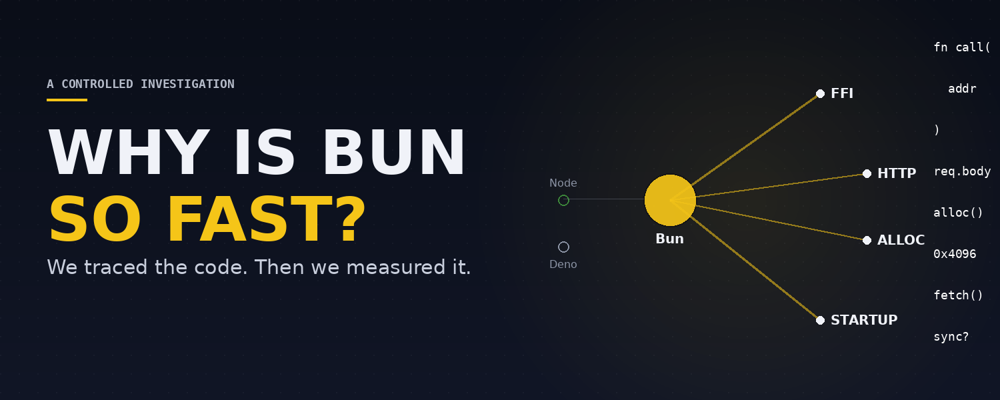

# Why Is Bun So Fast?

A source-level and experimental investigation into Bun's performance compared with Node.js and Deno.

This repository contains the complete public research behind the article **[Why Is Bun So Fast?](article/why-bun-is-fast.md)**: the source-code reading that generated each hypothesis, the six controlled experiments that tested them, the raw measurements, the analysis, and the final results.



## Research question

Why does Bun perform differently from Node.js and Deno — and is there one underlying reason, or several?

## What we investigated

We traced Bun, Node.js, and Deno through their source code and then tested six specific, source-motivated performance hypotheses:

- **[H1](experiments/h1-native-call-boundary/)** — native call boundary: does the binding path (not just the JS engine) affect the cost of calling native code from JavaScript?
- **[H2](experiments/h2-fetch-thread-hop/)** — `fetch()` thread-hop overhead: does Bun's dedicated background thread for `fetch()` cost more than it's worth?
- **[H3](experiments/h3-coldstart-page-faults/)** — cold-start page faults: does Bun's documented startup binary layout reduce page faults, and does that make it start faster?
- **[H4](experiments/h4-http-sync-async/)** — `Bun.serve()` sync vs. async path: does the header/URL copy on request suspension show up as a measurable cost?
- **[H5](experiments/h5-buffer-pool/)** — Buffer allocation/pooling: does Node's buffer-pooling strategy (which Bun doesn't replicate) create a measurable allocation advantage?
- **[H6](experiments/h6-realistic-io-convergence/)** — realistic, database-backed HTTP workload: does adding real I/O change which runtime wins, and does the gap between runtimes shrink?

A seventh hypothesis, H7 (Bun's startup cache vs. Node's opt-in equivalent), was deliberately deferred — see [`experiments/h7-startup-cache-config/`](experiments/h7-startup-cache-config/).

## Main conclusion

The research did not identify one universal "Bun is fast because X" explanation.

Performance was strongly workload- and implementation-path dependent. The winner changed depending on factors such as:

- which native binding path a call takes
- allocation size
- request concurrency
- connection state (cold vs. keep-alive)
- startup binary layout vs. actual measured startup time
- workload composition (plaintext vs. database-backed)

See the article's [§10, "So what actually makes Bun fast?"](article/why-bun-is-fast.md#10-so-what-actually-makes-bun-fast) and [§11, "Where Bun doesn't win"](article/why-bun-is-fast.md#11-where-bun-doesnt-win) for the full synthesis, including every case where Bun did *not* win.

## Important limitation

All six controlled experiments were performed on shared 2-vCPU cloud hardware using release builds of all three runtimes, not dedicated benchmarking hardware or the project's originally intended source-controlled builds. These results should therefore be treated as controlled experimental evidence about *why* the measured differences exist, not as universal production benchmarks you should expect to reproduce exactly on your own hardware. Full detail: [`methodology/environment.md`](methodology/environment.md).

## What we did

We traced Bun, Node.js, and Deno through their source code and then tested six specific performance hypotheses (listed above), each designed around a falsifier decided *before* the experiment was run. Where a result contradicted the hypothesis, it's reported and preserved — see each experiment's README for its own counter-evidence.

## Reproducibility

Each experiment contains:

- benchmark source code
- exact methodology
- runtime versions and environment details
- raw measurements (one file per run, where safe to publish)
- computed statistics (`results/summary.json`)
- a written results summary

The raw data is preserved so every reported number can be independently checked. See [`methodology/reproducibility.md`](methodology/reproducibility.md) for exactly how.

## Repository structure

```
article/            the article itself, with links back into experiments/ for every claim
experiments/         all seven hypotheses (H1–H6 executed, H7 deferred) — source, raw data, results
source-notes/        source-code research notes on runtime architecture, JSC vs. V8, native bindings, HTTP, memory
methodology/          shared benchmark methodology, environment details, reproducibility guide
figures/              the six article visuals plus the article thumbnail
```

## A note on how this repository was prepared

Private infrastructure identifiers (internal machine IDs, internal filesystem paths) were sanitized out of the raw metadata before publication. No benchmark number, run count, hardware specification, runtime version, or experimental conclusion was changed in that process — see [`methodology/environment.md`](methodology/environment.md) for exactly what was generalized and why.

## License

[MIT](LICENSE).
